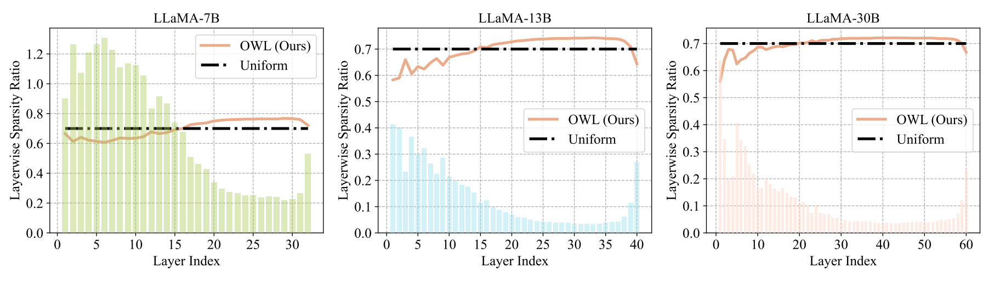
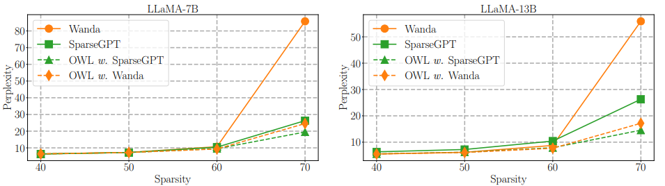

#  [Outlier Weighed Layerwise Sparsity (OWL): A Missing Secret Sauce for Pruning LLMs to High Sparsity [ICML 2024] ](https://arxiv.org/abs/2310.05175)

<p align="center">

</p>


Official PyTorch implementation of  **OWL**: A Missing Secret Sauce for Pruning LLMs to High Sparsity

[Lu Yin](https://luuyin.com//), [You Wu](https://research.google/people/YouWillWu/), [Zhenyu Zhang](https://scholar.google.com/citations?user=ZLyJRxoAAAAJ&hl=zh-CN), [Cheng-Yu Hsieh](https://chengyuhsieh.github.io/), [Yaqing Wang](https://yaqingwang.github.io/), [Yiling Jia](https://yilingjia.github.io/), [Mykola Pechenizkiy](https://www.tue.nl/en/research/researchers/mykola-pechenizkiy), [Yi Liang](https://research.google/people/108265/), [Zhangyang Wang](https://vita-group.github.io/), [Shiwei Liu](https://shiweiliuiiiiiii.github.io/)

**University of Texas at Austin, Eindhoven University of Technology, Google Research, NY. University of Washington.**

The code can be contacted at l.yin@tue.nl.


<p align="center">

</p>

 OWL layerwise sparsity and Uniform layerwise sparsity at 70% sparsity. The bar chart in background corresponds to the Layerwise Outlier Distribution.


## Update
- [x] (10.2023) Add support for [OWL-wanda n:m sparsity](https://github.com/luuyin/OWL/blob/main/lib/prune_all.py#L498).
- [x] (05.2024) Add support for CPU acceleration.
- [x] (06.2024) Add support for Lora finetuning
      
## Table of contents

* [Abstract](#abstract)


* [Results](#Results)

* [Installation](#installation)
* [Usage](#Usage)


## TL;DR
--- 
Inspiring by the strong correlation to the emergent outliers in the feature dimensions in LLMs, we propose effective layer-wise sparsity ratios for LLM pruning, achieving significant improvement.


## Abstract
--- 
Large Language Models (LLMs), renowned for their remarkable performance across diverse domains, present a challenge due to their colossal model size when it comes to practical deployment. In response to this challenge, efforts have been directed toward the application of traditional network pruning techniques to LLMs, uncovering a massive number of parameters can be pruned without hurting performance. Building upon insights gained from pre-LLM models, particularly BERT-level language models, prevailing LLM pruning strategies have consistently adhered to the practice of uniformly pruning all layers at equivalent sparsity levels, resulting in robust performance. However, this observation stands in contrast to the prevailing trends observed in the field of vision models, where non-uniform layerwise sparsity typically yields substantially improved results. To elucidate the underlying reasons for this disparity, we conduct a comprehensive analysis of the distribution of token features within LLMs. In doing so, we discover a strong correlation with the emergence of outliers, defined as features exhibiting significantly greater magnitudes compared to their counterparts in feature dimensions. Inspired by this finding, we introduce a novel LLM pruning methodology that incorporates a tailored set of non-uniform layerwise sparsity ratios specifically designed for LLM pruning, termed as Outlier Weighed Layerwise sparsity **(OWL)**. The sparsity ratio of OWL is directly proportional to the outlier ratio observed within each layer, facilitating a more effective alignment between layerwise weight sparsity and outlier ratios. Our empirical evaluation, conducted across the LLaMA-V1 family and OPT, spanning various benchmarks, demonstrates the distinct advantages offered by OWL over previous methods. For instance, our approach exhibits a remarkable performance gain, surpassing the state-of-the-art Wanda and SparseGPT by 61.22 and 6.80 perplexity at a high sparsity level of 70%, respectively. Code is submitted.


## Results 
--- 

<p align="center">

</p>

<p style="text-align: center;"><i>WikiText validation perplexity of OWL applied to SparseGPT and Wanda</i></p>


| **Method** | **Layerwise Sparsity** | **Weight Update** | **LLaMA-V1 7B** | **LLaMA-V1 13B** | **LLaMA-V1 30B** | **LLaMA-V1 65B** | **OPT 6.7B** |
|------------|------------------------|-------------------|----------------|------------------|------------------|------------------|--------------|
| Dense      | -                      | -                 | 5.68           | 5.09             | 4.10             | 4.77             | 10.13        |
| Magnitude  | Uniform                | ❌               | 48419.12       | 84539.45         | 977.73           | 46.89            | 290985.03    |
| Wanda      | Uniform                | ❌               | 85.77          | 55.90            | 17.37            | 15.23            | 162.92       |
| OWL w. Wanda | Non-Uniform             | ❌               | **24.55** | **17.17** | **10.75** | **8.61** | **40.22** |
| SparseGPT  | Uniform                | ✔️               | 26.30          | 19.24            | 12.56            | 10.45            | **20.29**    |
| OWL w. SparseGPT | Non-Uniform         | ✔️               | **19.49** | **14.55** | **10.28** | **8.28** | 22.48   |


<p style="text-align: center;"><i>WikiText validation perplexity of pruning methods for LLaMA-V1 family and OPT-6.7B at 70% sparsity. 
The best performance method is indicated in <b>bold </b>, and the gain in perplexity achieved by OWL is highlighted in blue.</i></p>


## Installation 
--- 
Installation instructions can be found in [INSTALL.md](INSTALL.md).


## Usage

--- 
We provide a quick overview of the arguments:  
- `--model`: The identifier for the LLaMA model on the Hugging Face model hub.
- `--cache_dir`: Directory for loading or storing LLM weights. The default is `llm_weights`.
- `--prune_method`: Pruning methods,namely [`wanda_owl`,`wanda_owl_structure`,`sparsegpt_owl`,`magnitude`, `wanda`, `sparsegpt`].
- `--sparsity_ratio`: Denotes the percentage of weights to be pruned.
- `--save`: Specifies the directory where the result will be stored.
- `--Hyper_m`: Denotes the hyperparameter of `M`.
- `--Lamda`:  Denotes the hyperparameter of `Lamda`.


--- 
### Script example of pruning llama-7b using OWL-wanda 

```
python   main.py    \
--model_name_or_path decapoda-research/llama-7b-hf     \
--Lamda 0.08 \
--Hyper_m 5 \
--model decapoda-research/llama-7b-hf     \
--prune_method wanda_owl     \
--sparsity_ratio 0.7 \
--sparsity_type unstructured \
--save save_test/
```

### Script example of pruning llama-7b using OWL-wanda [n:m sparsity]
```
python   main.py    \
--model_name_or_path decapoda-research/llama-7b-hf     \
--Lamda 2 \
--Hyper_m 6 \
--model decapoda-research/llama-7b-hf     \
--prune_method wanda_owl_structure      \
--sparsity_ratio 0.5 \
--sparsity_type "5:8"  \
--save save_test/
```


### Script example of pruning llama-7b using OWL-SparseGPT
```
python   main.py    \
--model_name_or_path decapoda-research/llama-7b-hf     \
--Lamda 0.08 \
--Hyper_m 5 \
--model decapoda-research/llama-7b-hf     \
--prune_method sparsegpt_owl     \
--sparsity_ratio 0.7 \
--sparsity_type unstructured \
--save save_test/
```

### Script example of pruning llama-7b using OWL-magnitude
```
python   main.py    \
--model_name_or_path decapoda-research/llama-7b-hf     \
--Lamda 0.08 \
--Hyper_m 5 \
--model decapoda-research/llama-7b-hf     \
--prune_method magnitude_owl      \
--sparsity_ratio 0.7 \
--sparsity_type unstructured \
--save save_test/
```


### Zero-shot evaluation

#### Step1: generation data: 

```
bash scripts/data_genration/run.sh 
```
#### Step2: obtain prediction:
```
bash benchmark/run.sh 
```
#### Step3: evaluation results: 

```
bash benchmark/eval.sh
```


###  CPU-Acceleration

Install [sparseml](https://github.com/neuralmagic/sparseml) and  [deepsparse](https://github.com/neuralmagic/deepsparse)

#### Step1: create sparse model checkpoint using OWL, and save to model_path
#### Step2: export checkpoint to ONNX format
```
sparseml.export --task text-generation model_path
```
#### Step3: evaluate using deepsparse
```
deepsparse.benchmark model_path/deployment/model.onnx --sequence_length 2048
```
###  Lora finetuning  on C4


#### Step1: lora ft checkpoint from "your_sparse_model_path", and save to "lora_ft_model_path"
CUDA_VISIBLE_DEVICES=0,1 python finetune_lm.py \
    --model_name_or_path "your_sparse_model_path" \
    --config_name "your_sparse_model_path" \
    --dataset_name c4 \
    --num_train_epochs 1 \
    --block_size 1024 \
    --per_device_train_batch_size 2 \
    --per_device_eval_batch_size 8 \
    --do_train \
    --do_eval \
    --max_train_samples 240000 \
    --max_eval_samples 128 \
    --learning_rate 1e-4 \
    --overwrite_output_dir \
    --output_dir "lora_ft_model_path"

#### Step2: evaluate the ppl
CUDA_VISIBLE_DEVICES=0,1 python evaluate_ppl.py \
    --model "your_sparse_model_path" \
    --lora_weights "lora_ft_model_path"
    

### Acknowledgement
This repository is build upon the [Wanda](https://github.com/locuslab/wanda) and [SparseGPT](https://github.com/IST-DASLab/sparsegpt) repositories. The cpu acceleration is based on  [sparseml](https://github.com/neuralmagic/sparseml) and  [deepsparse](https://github.com/neuralmagic/deepsparse) repositories.


## Citation
if you find this repo is helpful, please cite

```
@article{yin2023outlier,
  title={Outlier weighed layerwise sparsity (owl): A missing secret sauce for pruning llms to high sparsity},
  author={Yin, Lu and Wu, You and Zhang, Zhenyu and Hsieh, Cheng-Yu and Wang, Yaqing and Jia, Yiling and Pechenizkiy, Mykola and Liang, Yi and Wang, Zhangyang and Liu, Shiwei},
  journal={arXiv preprint arXiv:2310.05175},
  year={2023}
}
```
